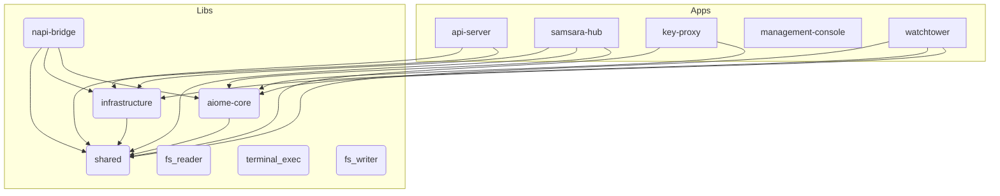

# 📐 Aiome Architecture Map (AI-First)

> This file is automatically generated by `scripts/generate_architecture.py` to provide a concise project structure overview for AI agents.

## 1. Core Paradigms
<!-- MANUAL_PARADIGM_START -->
- **Pattern B Architecture**: Front-end uses Gemini Cloud (`gemini-2.5-flash`), Background tasks use Ollama Local (`qwen3.5:9b`).
- **Abyss Vault**: Physical isolation of API keys in `key-proxy` process. Main AI engine holds no keys.
- **WASM/Docker Sandboxing**: Strict isolation for executing dynamic AI skills.
<!-- MANUAL_PARADIGM_END -->

## 2. Key Data Flow
<!-- MANUAL_FLOW_START -->
1. **User Interaction**: User inputs prompt in Management Console (Tauri/React).
2. **Routing**: `api-server` receives request, verifies auth.
3. **LLM Chain**: Context Engine injects UI state & KIs -> Request sent to LLM.
4. **Background**: `watchtower` loop runs every 5 mins, processes async skills via JobQueue.
<!-- MANUAL_FLOW_END -->

## 3. System Topology (Internal Dependencies)



## 4. Directory Map (Crates)

| Crate | Path | Description |
|---|---|---|
| `api-server` | `apps/api-server` | (Core Module) |
| `samsara-hub` | `apps/samsara-hub` | (Core Module) |
| `key-proxy` | `apps/key-proxy` | (Core Module) |
| `aiome-core` | `libs/core` | (Core Module) |
| `infrastructure` | `libs/infrastructure` | (Core Module) |
| `shared` | `libs/shared` | (Core Module) |
| `fs_reader` | `libs/wasm-skills/fs_reader` | (Core Module) |
| `terminal_exec` | `libs/wasm-skills/terminal_exec` | (Core Module) |
| `fs_writer` | `libs/wasm-skills/fs_writer` | (Core Module) |
| `napi-bridge` | `libs/napi-bridge` | (Core Module) |
| `management-console` | `apps/management-console/src-tauri` | A Tauri App |
| `watchtower` | `apps/watchtower` | (Core Module) |

## 5. Critical Environment Variables
*(Auto-extracted from `.env.example`)*
```text
DISCORD_TOKEN, DISCORD_LOG_CHANNEL_ID, DISCORD_COMMAND_CHANNEL_ID, DISCORD_CHAT_CHANNEL_ID, TELEGRAM_TOKEN, TELEGRAM_CHAT_ID, LLM_PROVIDER, OLLAMA_BASE_URL, OLLAMA_MODEL, LM_STUDIO_HOST, GEMINI_API_KEY, OPENAI_API_KEY, ANTHROPIC_API_KEY, BG_LLM_PROVIDER, BG_LLM_MODEL, EMBEDDING_PROVIDER, RURI_EMBED_URL, NODE_ID, FEDERATION_SECRET, SAMSARA_HUB_REST, SAMSARA_HUB_WS, API_WS_URL, ADVANCED_EXPERIENCE_MODE, LOG_LEVEL, JSON_LOGS, PORT, ENFORCE_GUARDRAIL, API_SERVER_SECRET, AIOME_DB_PATH, MCP_CONFIG_PATH, SEARCH_API_KEY, BRAVE_SEARCH_API_KEY, VAULT_SECRET, KEY_PROXY_URL, KEY_PROXY_PORT
```

---
*Last Auto-Generated: 2026-03-14 22:30:34 UTC*
