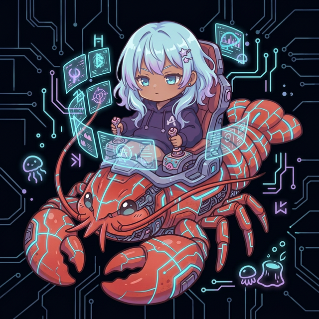

<p align="center">
  
</p>

<h1 align="center">Aiome (アイオーム)</h1>
<p align="center">
  <strong>The Autonomous AI Operating System for Self-Evolving Agents</strong><br>
  <em>Build AI that Learns, Defends, and Evolves — Autonomously.</em>
</p>

<p align="center">
  
  
  
</p>

---

## 🌌 Aiome とは？ (Concept)

Aiome は、単なるタスク実行ツールではありません。実行のたびに「教訓（Karma）」を蓄積し、脅威から自らを保護（Immune System）し、他のノードと知能を共有（Federation）しながら、独自の「人格（SOUL）」を形成していく、**次世代の自律型 AI オペレーティングシステム**です。

動画生成（Project-Boring 等）は、この強力な OS 上で動作する一つの「スキル（モジュール）」に過ぎません。

### 🛡️ 4つのコア・バリュー (Core Pillars)

1.  **Self-Evolution (自己進化 / Karma)**: 失敗と成功を SQLite に蓄積し、二度と同じミスを繰り返さない学習能力。
2.  **Self-Defense (自己防御 / Immune System)**: 不正な出力や無限ループを検知し、自律的に回路を遮断・修復する免疫システム。
3.  **Swarm Intelligence (群知能 / Federation)**: Samsara Hub を通じて、世界中の Aiome ノードが獲得した「教訓」を瞬時に同期。
4.  **Personality (人格 / SOUL Architecture)**: ユーザーとの対話を通じてシミュレーションされる、単なるツールを超えた「パートナー」としてのアイデンティティ。

---

## 🏗️ アーキテクチャ (Open-Core Strategy)

当プロジェクトは、エコシステムの健全な発展のために**オープンコアモデル**を採用しています。

### 🟢 Aiome Core (OSS版 - AGPL-3.0)
基盤となる Karma スキーム、Immune 防御、Federation 同期、および基本的な SOUL エンジンはオープンソースとして提供されます。

### 🔴 Aiome Pro / Enterprise (商用ライセンス)
高度な並列処理（GPU Cluster）、高性能実行エンジン（Advanced Skill Forge）、および企業向けのマネージド Hub 機能は、商用ライセンスの下で提供されます。

---

## 🛰️ 実行コンポーネント



### 1. 監視所 (Watchtower) — The Manifestation of SOUL
Watchtower は、Aiome の「人格」がマスターと触れ合うための窓口です。Discord を通じて、システムの稼働状態を報告したり、マスターの指示を待機したり、時には自律的な提案を行います。

- **詳細**: [docs/WATCHTOWER_USER_GUIDE.md](docs/WATCHTOWER_USER_GUIDE.md)
- **人格定義**: [SOUL.md](SOUL.md) / [docs/CUSTOMIZING_SOUL.md](docs/CUSTOMIZING_SOUL.md)

### 2. 工場 / スキル (Skills & Modules)
Aiome Core 上で動作する具体的なアプリケーション（動画生成、コード生成、リサーチ等）です。

- **Shorts Factory**: YouTube Shorts 向けの全自動動画量産モジュール。

---

## 🚀 クイックスタート (Quick Start)

### 1. セットアップ
```bash
git clone https://github.com/motivationstudio-llc/aiome
cd aiome
cp .env.example .env  # APIキーや Discord トークンの設定
```

### 2. 起動
```bash
# Aiome Core サーバーの起動
cargo run -p shorts-factory -- serve

# Watchtower (Discord Bot) の起動
cargo run -p watchtower
```

---

## 📚 ドキュメント (Documentation)

- **[AI憲法 (Architecture Law)](docs/ARCHITECTURE_LAW.md)**: 知的誠実性と安全性を担保する基本原則。
- **[運用マニュアル (Operations Guide)](docs/OPERATIONS_MANUAL.md)**: 詳細な環境構築と運用手順。
- **[進化戦略 (Evolution Strategy)](docs/EVOLUTION_STRATEGY.md)**: 自己進化と育成システムの設計思想。
- **[セキュリティ設計 (Security Design)](docs/SECURITY_DESIGN.md)**: 多層防御システムの詳細。

---

## 🤝 コントリビュート (Contributing)

Aiome の進化には、あなたの力が必要です。バグ報告、機能提案、コードの寄付を歓迎します。

- **[貢献ガイド (CONTRIBUTING.md)](CONTRIBUTING.md)**: 開発参加のルール。
- **[ライセンス同意書 (CLA.md)](CLA.md)**: 権利関係の合意。
- **[行動規範 (CODE_OF_CONDUCT.md)](CODE_OF_CONDUCT.md)**: コミュニティの行動基準。
- **[脆弱性の報告 (SECURITY.md)](SECURITY.md)**: セキュリティ問題の連絡先。

---

## 🛡️ ライセンス (License)

**Aiome Core** は **AGPL-3.0** の下で提供されています。商用利用や特化機能が必要な場合は、[Aiome Enterprise (motivationstudio.co)](https://github.com/motivationstudio-llc/aiome) までお問い合わせください。

*Built by [motivationstudio,LLC](https://github.com/motivationstudio-llc) — Powering the Future of AI Autonomy.*
