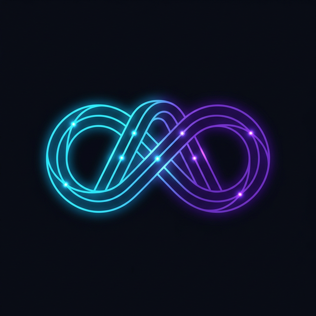
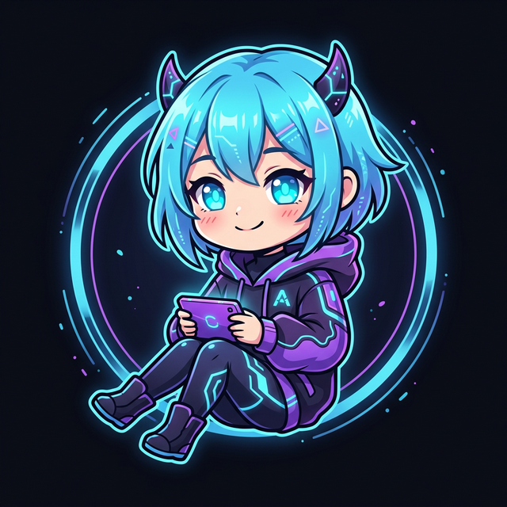

<div align="right">
  <strong>日本語</strong> | <a href="README_en.md">English</a>
</div>

<p align="center">
  
</p>

<h1 align="center">Aiome (アイオーム)</h1>
<p align="center">
  <strong>The Autonomous AI Operating System for Self-Evolving Agents</strong><br>
  <em>Build AI that Learns, Defends, and Evolves — Autonomously.</em>
</p>

<p align="center">
  
  
  
  
  <a href="https://github.com/google/antigravity"></a>
</p>

---

## 🌌 Aiome とは？ (Philosophy & Concept)

Aiome は、単なるタスク実行ツールやエージェント・フレームワークではありません。

**「野放しの自立性 (Raw Autonomy)」 から 「規律ある自立性 (Disciplined Autonomy)」へ。**
OpenClaw のような純粋なエージェントにそのままシステムを委ねることは、一見自由度が高いようで、無限ループやAPIキー漏洩などのリスクを孕む「脆い自由」です。
Aiome が提供するのは、AIの自由を奪うことではなく、**「人間が24時間監視していなくても、30日間連続で稼働させ続けられるための強固な規律と免疫」**です。

### 🤖 開発の哲学：エージェントによる、エージェントのためのOS (Built by Agents)

Aiome のコード一行一行は、人間ではなく **Google Antigravity** 上の AI エージェントによって **100% エージェンティック・コーディング** で構築されました。

これは単なる技術的な実験ではありません。
エージェントが自ら、「自分たちが最も安全に、かつ規律を持って活動できる環境」を自律的に設計・実装した結果です。人間のバイアスや見落としを、AI による厳格なコード生成とセルフレビュー、そして「鉄の掟（Golden Rules）」の遵守によって補完し、従来のソフトウェア開発の限界を超えた堅牢性を目指しています。

### 🛡️ 4つのコア・バリュー (Core Pillars)

1.  **The Sandbox (形式検証された絶対防衛網)**: 直接シェルを渡すのではなく、WASMコンテナや APIキーを物理隔離する Abyss Vault を通します。Aiome の隔離プロトコルと知識ハッシュチェーンプロトコルは **TLA+ を用いてその安全性が数学的・アルゴリズム的に証明（TLC Model Checker 通過済）** されています。さらに、RustのTypeStateパターンとモデルベーステスト（MBT）を組み合わせることで、**「数学的に証明された安全性が、運用レベルのバイナリまで100%保証される（セキュリティ成熟度95%達成）」** 業界最高水準の堅牢な隔離環境を提供します。
2.  **The Immune System (記憶の改ざん耐性と教訓)**: エラーが起きても忘却しないよう、SQLite上の暗号学的ハッシュチェーン (Karma) を使い、「自分が過去に何のタスクに失敗したか」を改ざん不可能な形で記録し、確実な進化の土台とします。
3.  **Swarm Intelligence (群知能 / Federation)**: Samsara Hub を通じて、世界中の Aiome ノードが獲得した「教訓」を瞬時に同期。
4.  **Personality (人格 / SOUL Architecture)**: ユーザーとの対話を通じてシミュレーションされる、単なるツールを超えた「パートナー」としてのアイデンティティ。

野生の天才脳（エージェント）が現実世界で安全に、かつ長期的に生存・進化するための「頭蓋骨、神経系、そして免疫システム」。これこそが Aiome というオペレーティングシステムの存在意義です。

---

## 🏗️ アーキテクチャ (Full OSS Foundation)

<table align="right">
  <tr>
    <td align="center">
      <br>
      <b>【Actor】</b>
    </td>
  </tr>
</table>

Aiome は**フル・オープンソース（Full OSS）**プロジェクトです。エンタープライズ級のセキュリティ（Abyss Vault）や自己進化機能は、すべて無料で解放されています。

### 🟢 ビジネスモデル (How we sustain)
私たちは OS を無料で提供し、その上で動くエコシステムで価値を創出します。
- **プレミアム・モジュール (Capabilities)**: 金融データ解析や高度映像生成などの特化型 WASM スキルの提供。
- **SAMSARA Hub (Managed Service)**: 企業向けに管理・高速化された連邦学習ハブのホスティング。
- **エンタープライズ・サポート**: 企業導入時の SLA 等の技術サポート。

```text
apps/command-center   ← メインバイナリ (The Body)
      ↓
libs/core            ← ドメインロジック (Open)
      ↓
libs/infrastructure  ← I/O実装 (SQLite / Open)
      ↓
libs/shared          ← 共通型, Guardrails (Open)
```

### 3. 初期起動と Synergy Experience (創世記)
Aiomeを初めて起動する際、システムは「創世（Genesis）」フェーズである **Synergy Experience** を開始します。

```bash
cargo run -p aiome-synergy
```
* **Synergy Bootstrapper**: 対話型のCLIを通じて、Aiomeの「魂（SOUL）」の初期設定、Watchtower（Discord）接続、外部API（Ollama / Gemini等）へのプロキシ経路のセキュアな確立を自律的に支援します。
* **The First Breath (初回呼吸)**: 初期ハッシュチェーンの生成と、最初のサンドボックス（WASM）のドライラン隔離検証が目の前で行われます。

---

## ✨ 主な機能・できること (Capabilities)

Aiome を導入することで、以下のような自律型ワークフローを瞬時に構築できます。

- 🧠 **完全自律思考 (Autonomous loop)**: ユーザーの指示なしで、24時間トレンドを監視し、企画からタスク実行までを全自動化。
- 🛡️ **堅牢なエラー自己修復ルール**: 実行エラーや LLM のハルシネーションを検知し、自らサンドボックス内で構成を修正して再実行。

---

## 🧩 スキル・エコシステム (Extensibility)

Aiome の真の力は、**WASM（WebAssembly）を利用した極めて高い拡張性**にあります。

- **Safe Sandbox**: 追加機能（スキル）は隔離された WASM 環境で実行されるため、コアシステムの安全性を脅かしません。
- **Auto-Forging**: AI 自身が必要な機能をその場でプログラミングし、自己実装・デプロイする「Skill Forge」機能（※Pro版/一部高度機能）を備えています。
- **Community Shared**: 開発したカスタムスキルは、将来的に SAMSARA Hub を通じて他のノードと共有可能になります。

---

## 🛠️ 技術スタック (Technical Stack)


| コンポーネント | 採用技術 | 役割 |
|---|---|---|
| **Core Engine** | Rust / Bastion OSS | 高速・メモリ安全かつ堅牢なセキュリティ基盤 |
| **Formal Verification** | TLA+ / TLC / Rust TypeState / MBT | 状態遷移のTLA+仕様化とモデルチェッカーによる検証。TypeStateと手動インテグレーションテストによる「数学からRust実行バイナリまでの絶対保証（95%カバレッジ）」 |
| **Security Layer** | Abyss Vault (Key Proxy) | APIキーの物理隔離とメモリ保護 (mlockall/zeroize) |
| **LLM Backend** | Ollama / Gemini (Proxy経由) | 状況に応じたローカル・クラウド推論の統合 |
| **Media Engine** | ComfyUI / FFmpeg | 高度な画像・動画・音声の自律生成 |
| **Storage** | SQLite (Hash Chain対応) | 改ざん耐性を持つ記憶（Karma）とログの永続化 |
| **Expansion** | WebAssembly (Wasm) | ネットワーク制限下での安全なスキル実行環境 |

---

## 🛰️ 実行コンポーネント

<table align="right">
  <tr>
    <td align="center">
      <br>
      <b>【WATCHTOWER】</b>
    </td>
  </tr>
</table>

### 1. 監視所 (Watchtower) — The Manifestation of SOUL
Watchtower は、Aiome の「人格」がユーザーと触れ合うための窓口です。Discord を通じて、システムの稼働状態を報告したり、ユーザーの指示を待機したり、自律的な提案を行います。

- **詳細**: [docs/WATCHTOWER_USER_GUIDE.md](docs/WATCHTOWER_USER_GUIDE.md)
- **人格定義**: [WATCHTOWER_MANIFEST.md](WATCHTOWER_MANIFEST.md) 🐾

### 2. 工場 / スキル (Skills & Modules)
Aiome Core 上で動作する具体的なアプリケーションです。

- **Command Center**: OSS版の標準デモ。テキストベースのリサーチとレポート生成、メディア処理の統合ハブ。

---

## 🚀 クイックスタート (Quick Start)

### 1. 準備 (Prerequisites)
以下の要件が満たされていることを確認してください：
- **System**: `ffmpeg` (動画・音声処理用) がパスに通っていること。
- **Ollama**: `ollama serve` が実行中。
  - 推奨構成: `qwen2.5-coder` (分析・制作用) & `mistral-small` (Watchtower人格用)
- **Sidecars (オプション)**:
  - **ComfyUI**: 画像・動画生成エンジン (デフォルト: `http://localhost:8188`)
  - **Style-Bert-VITS2**: 音声合成サーバー。Python 3.10+ 環境が必要です。
- **External API**: 外部 API（Gemini/OpenAI 等）を利用する場合、セキュア・プロキシに渡す環境変数が必要です。

### 2. セットアップ・実行
```bash
# 1. リポジトリのクローン
git clone https://github.com/motivationstudio-llc/aiome
cd aiome

# 2. 環境変数の設定 (APIキーなど)
cp .env.example .env

# 3. Abyss Vault (Key Proxy) の起動
# ⚠️ 全ての API リクエストはこのプロキシを通過します。必ず最初に起動してください。
GEMINI_API_KEY=your_key_here cargo run --bin key-proxy &

# 4. Command Center の起動 (The Body)
cargo run -p command-center

# 5. Watchtower (Discord Client) の起動 (The Soul)
cargo run -p watchtower
```

> **Note**: `command-center` は UDS ソケットを通じて `watchtower` と通信します。対話機能（Discord連携）を有効にするには、両方のプロセスを同時に実行してください。

### シナジー体感デモ (Synergy Demonstration)
Aiome 管理コンソールでは、OpenClaw との相乗効果を視覚的に体験できます。

1. **Dashboard 起動**: `cargo run -p api-server` を実行。
2. **アクセス**: ブラウザで `http://localhost:3015` を開く。
3. **Synergy Panel**: サイドバーの **"Agency Synergy"** から以下のデモを試せます：
    - **Evolution Pulse**: タスク失敗から教訓（Karma）が蒸留される過程の視覚化。
    - **Security Shield**: Abyss Vault による API キー強奪試行の物理的阻止。
    - **Swarm Sync**: 他ノードとの免疫知識（Collective Intelligence）の同期。

#### 🔑 主な環境変数 (.env)
- `DISCORD_TOKEN`: Watchtower integration 用。
- `OLLAMA_BASE_URL`: LLM接続用 (デフォルト: `http://localhost:11434`)。
- `EXTERNAL_SERVICE_URL`: ComfyUI など外部生成エンジン連携用。

---

## 📚 ドキュメント (Documentation)

- **[AI憲法 (Architecture Law)](docs/ARCHITECTURE_LAW.md)**: 知的誠実性と安全性を担保する基本原則。
- **[運用マニュアル (Operations Guide)](docs/OPERATIONS_MANUAL.md)**: 詳細な環境構築と運用手順。
- **[進化戦略 (Evolution Strategy)](docs/EVOLUTION_STRATEGY.md)**: 自己進化と育成システムの設計思想。
- **[人格のカスタマイズ (Soul Customization)](docs/CUSTOMIZING_SOUL.md)**: AIの性格や反応の調整方法。
- **[セキュリティ設計 (Security Design)](docs/SECURITY_DESIGN.md)**: 多層防御の詳細。

---

## 🤝 コントリビュート (Contributing)

- **[貢献ガイド (CONTRIBUTING.md)](CONTRIBUTING.md)**: 開発参加のルール。
- **[ライセンス同意書 (CLA.md)](CLA.md)**: 権利関係の合意。
- **[行動規範 (CODE_OF_CONDUCT.md)](CODE_OF_CONDUCT.md)**: 行動基準。
- **[脆弱性の報告 (SECURITY.md)](SECURITY.md)**: セキュリティの連絡先。

---

## 🛡️ ライセンス (License)

**Aiome Core** は **MIT License** の下で提供されています。商用利用についての相談やサポートなどは [motivationstudio,LLC](https://github.com/motivationstudio-llc/aiome) まで。

*Built by [motivationstudio,LLC](https://github.com/motivationstudio-llc) — Powering the Future of AI Autonomy.*
